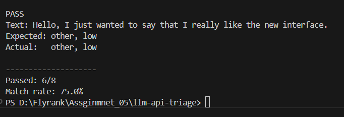

Yes. Use this as your `README.md`. I’ve kept it professional but simple and aligned with the work you actually completed.

````markdown
# LLM API Triage

A FastAPI backend that classifies support messages using an LLM and returns a validated JSON response.

The API accepts a messy support message, sends it to an LLM through OpenRouter, parses and validates the response, and returns a structured support triage result.

## Features

- FastAPI REST API
- Pydantic request and response validation
- OpenRouter LLM integration using the OpenAI Python client
- Versioned prompt (`triage-v1`)
- JSON parsing of LLM output
- Pydantic validation of LLM output
- One automatic repair attempt for invalid LLM output
- 30-second LLM request timeout
- Retry handling for:
  - Timeouts
  - Rate limits (`429`)
  - Server errors (`5xx`)
- Exponential backoff with jitter
- `Retry-After` header support for rate limits
- Structured logging
- LLM kill switch using `LLM_ENABLED`
- Evaluation using 8 hand-labelled test cases

## Tech Stack

- Python 3
- FastAPI
- Pydantic
- OpenAI Python Client
- OpenRouter
- python-dotenv
- Requests
- Git / GitHub

## Project Structure

```text
llm-api-triage/
│
├── evals/
│   ├── cases.json
│   └── run_eval.py
│
├── logs/
│   └── app.log
│
├── prompts/
│   └── triage-v1.md
│
├── src/
│   └── llm/
│       ├── client.py
│       └── parser.py
│
├── main.py
├── .env.example
├── .gitignore
└── README.md
````

## Setup

Create a virtual environment:

```bash
python -m venv venv
```

Activate it on Windows:

```bash
venv\Scripts\activate
```

Install the dependencies:

```bash
pip install fastapi uvicorn openai pydantic python-dotenv requests
```

## Environment Variables

Create a `.env` file in the project root:

```env
LLM_BASE_URL=https://openrouter.ai/api/v1
LLM_API_KEY=your_api_key_here
LLM_MODEL=openrouter/free
LLM_ENABLED=true
```

Do not commit `.env` to GitHub because it contains the API key.

`.env.example` is provided as a template.

## Running the API

Start the FastAPI server:

```bash
uvicorn main:app --reload
```

The API will be available at:

```text
http://127.0.0.1:8000
```

Interactive API documentation:

```text
http://127.0.0.1:8000/docs
```

## API Endpoint

### POST `/triage`

Accepts a support message.

### Request

```json
{
  "text": "I was charged twice for my subscription."
}
```

### Response

```json
{
  "validated_llm_response": {
    "category": "billing",
    "urgency": "high",
    "confidence": 0.94,
    "reason": "The customer reports a duplicate subscription charge."
  }
}
```

## Allowed Categories

The LLM must classify messages into one of:

```text
billing
bug
feature
other
```

## Allowed Urgency Levels

```text
low
normal
high
```

If the model is unsure, the prompt instructs it to use:

```text
category = other
```

with a low confidence.

## Input Validation

The API accepts a `text` field with:

* Minimum length: 1 character
* Maximum length: 2000 characters

Pydantic validates the request before the endpoint processes it.

## LLM Output Validation

LLM output is treated as untrusted data.

The application:

1. Receives the LLM response.
2. Extracts the JSON object.
3. Parses it using Python's JSON parser.
4. Validates it using the `TriageResponse` Pydantic model.
5. If parsing or validation fails, one repair request is sent to the LLM.
6. If the repaired response also fails validation, the request fails instead of returning invalid LLM data.

The API does not return raw LLM output as the final result.

## Timeout and Retry Handling

LLM requests have a 30-second timeout.

The application retries selected temporary failures:

* Timeout
* Rate limit (`429`)
* Server errors (`5xx`)

The retry mechanism uses exponential backoff with jitter.

For rate-limit responses, the application checks the provider's `Retry-After` header when available and waits for the specified amount of time.

Permanent client errors such as authentication or invalid-request errors are not retried.

## LLM Kill Switch

LLM usage can be disabled using:

```env
LLM_ENABLED=false
```

When disabled, the API returns HTTP `503` instead of making an LLM request.

Enable it again with:

```env
LLM_ENABLED=true
```

## Logging

Application events and LLM failures are written to:

```text
logs/app.log
```

Logs include information such as:

* Model
* Request latency
* Success/failure
* Retry count
* Error type

The log file is excluded from Git tracking and is not committed to the repository.

## Prompt Version

The current prompt is:

```text
triage-v1
```

It is stored in:

```text
prompts/triage-v1.md
```

The prompt requires the LLM to return only the expected JSON structure and restricts category and urgency values to the allowed options.

## Evaluation

The API was evaluated using 8 hand-labelled support cases covering:

* Billing
* Bug
* Feature requests
* Other/general messages

The evaluation script is located at:

```text
evals/run_eval.py
```

The test cases are stored in:

```text
evals/cases.json
```

The evaluator compares the API's:

* `category`
* `urgency`

against the expected labels.

### Evaluation Result

The evaluation was run against 8 test cases.

The results can vary between runs because LLM responses are probabilistic. A low temperature reduces variation but does not guarantee identical output for every request.

The reported evaluation result should therefore correspond to the specific evaluation run recorded for this project.

## Error Responses

Examples of HTTP responses used by the API include:

| Status | Meaning                                             |
| ------ | --------------------------------------------------- |
| 200    | Successful triage                                   |
| 422    | Request validation or LLM output validation failure |
| 429    | LLM rate limit                                      |
| 500    | Unexpected server/LLM error                         |
| 503    | LLM service disabled                                |
| 504    | LLM request timeout                                 |

## Security Notes

* API keys are stored in `.env`.
* `.env` is excluded from Git.
* Runtime log files are excluded from Git.
* LLM output is never trusted without parsing and validation.
* The application does not return unrestricted model output directly.

## Future Improvements

Possible improvements include:

* More evaluation cases
* Separate category and urgency accuracy metrics
* More detailed cost tracking
* Better structured JSON logging
* Automated tests for retry and repair behavior
* Additional prompt versions for comparison

````

## Evaluation Result

- Test cases: 8
- Passed: 6/8
- Match rate: 75%
- Evaluation date: 2026-09-19
- Prompt version: triage-v1

> Note: LLM responses are probabilistic, so running the evaluation again may produce different results.

### Evaluation Output



````
